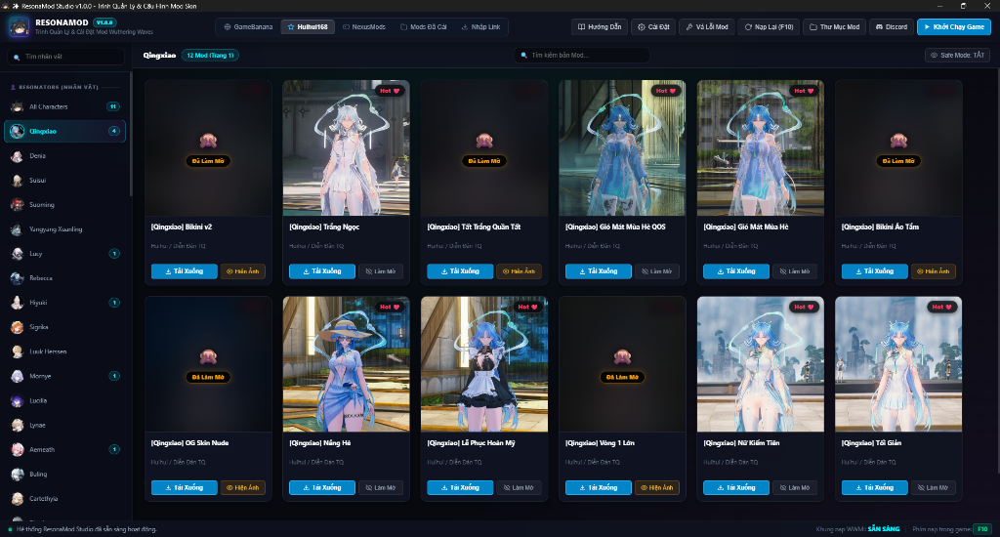

<p align="center">
  
</p>

<h1 align="center">ResonaMod Studio</h1>

<p align="center">
  <b>Trình quản lý, cài đặt và tự động tối ưu hóa Mod Skin cho Wuthering Waves (鸣潮)</b>
</p>

<p align="center">
  <a href="https://github.com/WahuVN/ResonaMod/releases"></a>
  <a href="https://discord.gg/tuRCj47sy"></a>
  
  <a href="./LICENSE"></a>
</p>

<p align="center">
  
</p>

---

## 📌 Tổng Quan (Overview)

**ResonaMod** là ứng dụng máy tính (Desktop App) mã nguồn mở giúp đơn giản hóa toàn bộ quá trình quản lý Mod Skin trong game **Wuthering Waves**. Ứng dụng tích hợp sâu với **WWMI / 3DMigoto**, tự động ngăn chặn xung đột skin, tự động sửa lỗi mesh/shader sau mỗi bản cập nhật game, đồng thời tích hợp kho tải mod trực tuyến đa nguồn tốc độ cao.

* **Không cần cài môi trường phức tạp**: Bản Standalone tải về mở là chạy ngay.
* **Tự động hóa hoàn toàn**: Tải mod, giải nén, sắp xếp đúng thư mục nhân vật và cấu hình phím tắt chỉ với 1 click.
* **An toàn & Linh hoạt**: Tự động nhận diện thư mục WWMI, chống trùng lặp skin và tích hợp sẵn chế độ bảo vệ làm mờ ảnh nhạy cảm (Safe Mode).

---

## ✨ Tính Năng Nổi Bật (Key Features)

| Tính Năng | Lợi Ích Mang Lại |
| :--- | :--- |
| **🛡️ Ngăn Chặn Xung Đột (Smart Anti-Conflict)** | Tự động tắt các mod skin khác của cùng một nhân vật khi bạn kích hoạt mod mới, loại bỏ hoàn toàn hiện tượng vỡ hình đè texture. |
| **🔧 Tích Hợp Bộ Vá Lỗi (WuWa Mod Fixer)** | Tự động vá Vertex Shader, Derived Hashes, LOD Bias và phục hồi biến dạng Mesh polygon khi game Wuthering Waves cập nhật phiên bản mới. |
| **🌐 Kho Tải Trực Tuyến Đa Nguồn** | Tìm kiếm và tải mod trực tiếp từ **GameBanana**, **Huihui168**, **NexusMods** hoặc dán link tải nhanh không giới hạn. |
| **⌨️ Quản Lý Phím Tắt Phụ Kiện** | Bật/tắt các chi tiết skin (tóc, váy, áo, tất, vũ khí...) và đổi phím bấm trực quan ngay trên giao diện mà không cần chỉnh sửa file `.ini` thủ công. |
| **🖼️ Chế Độ Làm Mờ An Toàn (Safe Mode)** | Tự động che mờ các hình ảnh mod nhạy cảm (NSFW) khi lướt duyệt, kèm trình xem ảnh phóng to chi tiết trước khi tải. |
| **🚀 Tự Động Cập Nhật (Auto-Updater)** | Tự động kiểm tra và gửi thông báo khi có phiên bản mới từ GitHub, cập nhật nhanh chóng chỉ với 1 thao tác. |

---

## 🚀 Hướng Dẫn Cài Đặt & Sử Dụng (Quick Start)

### Dành cho người chơi (Bản Standalone - Khuyên Dùng)

1. Tải bản mới nhất **`ResonaMod-v1.0.2-Standalone.zip`** tại mục **[Releases](https://github.com/WahuVN/ResonaMod/releases)**.
2. Giải nén thư mục `ResonaMod` và đặt vào thư mục **`WWMI`** của bạn (hoặc đặt ở bất cứ đâu trên ổ cứng).
3. Chạy file **`ResonaMod.exe`** (hoặc mở file `1_Mo_ResonaMod.bat`).
4. **Cách chơi mod**:
   * **Bước 1**: Chọn nhân vật ở cột bên trái ➔ Bấm **Tải Xuống** ở bản mod bạn thích.
   * **Bước 2**: Bấm nút **Khởi Chạy Game** ở góc trên cùng để vào game qua WWMI.
   * **Bước 3**: Nhấn phím **`F10`** khi đang trong game để nạp skin.

---

## 💻 Dành Cho Lập Trình Viên (Developer Guide)

### Yêu cầu hệ thống (Prerequisites)
* **Hệ điều hành**: Windows 10 / Windows 11 (64-bit).
* **Python**: Phiên bản 3.10 trở lên.
* **WebView2 Runtime**: Microsoft Edge WebView2 (mặc định đã có trên Windows 10/11).

### Cài đặt & Chạy từ mã nguồn

```bash
# 1. Clone mã nguồn về máy
git clone https://github.com/WahuVN/ResonaMod.git
cd ResonaMod

# 2. Cài đặt các thư viện phụ thuộc
pip install -r requirements.txt

# 3. Chạy ứng dụng trực tiếp
python ResonaMod.py
```

### Đóng gói file chạy độc lập (.EXE Standalone)

```bash
python build_release.py
```
> Kết quả sau khi đóng gói sẽ nằm trong thư mục `dist/ResonaMod` và file nén `dist/ResonaMod-v1.0.0-Standalone.zip`.

---

## 📂 Cấu Trúc Dự Án (Project Structure)

```text
ResonaMod/
├── assets/                  # Hình ảnh giao diện và preview cho tài liệu
│   └── preview.png          # Ảnh chụp màn hình ứng dụng chất lượng cao
├── avatars/                 # Kho ảnh chân dung Resonators được tối ưu hóa
├── tools/                   # Bộ công cụ tích hợp sẵn chạy nền
│   ├── 7z.exe / 7z.dll      # Trình giải nén siêu tốc
│   └── wuwa-mod-fixer/      # Công cụ sửa lỗi Mesh/Shader (Moonholder engine)
├── .github/workflows/       # CI/CD tự động build bản Standalone trên GitHub Actions
├── 1_Mo_ResonaMod.bat       # Phím tắt mở nhanh ứng dụng
├── 2_Mo_Thu_Muc_Mods.bat    # Phím tắt mở nhanh thư mục Mods của WWMI
├── ResonaMod.py             # Toàn bộ mã nguồn Backend Python & Giao diện WebView2
├── build_release.py         # Kịch bản tự động tối ưu hóa và build PyInstaller
├── requirements.txt         # Danh sách thư viện Python yêu cầu
├── LICENSE                  # Giấy phép mã nguồn mở MIT
└── README.md                # Tài liệu hướng dẫn sử dụng và giới thiệu
```

---

## 🛠️ Công Nghệ Sử Dụng (Tech Stack)

* **Ngôn ngữ**: Python 3 (Backend logic, đa luồng quét thư mục, quản lý file).
* **Giao diện**: HTML5 / Modern CSS3 (Dark Theme chuẩn Linear & Steam) / JavaScript ES6.
* **Giao diện nền tảng (GUI Framework)**: [PyWebView](https://pywebview.flowrl.com/) tích hợp Microsoft Edge WebView2.
* **Xử lý đồ họa & nén**: Pillow (PIL), LRU Base64 Image Caching.
* **Đóng gói phân phối**: PyInstaller.

---

## 🗺️ Lộ Trình Phát Triển (Roadmap)

- [x] Tự động hóa phát hiện liên kết thư mục WWMI & 3DMigoto.
- [x] Tích hợp kho mod trực tuyến (GameBanana, Huihui168, NexusMods).
- [x] Bộ vá lỗi Mesh & Shader v3.6.0.
- [x] Giao diện Modern Desktop với biểu tượng Vector SVG tinh tế.
- [x] Hệ thống kiểm tra phiên bản tự động (Auto-Updater).
- [ ] Tích hợp tính năng tự tạo preset mod skin theo đội hình chiến đấu.
- [ ] Hỗ trợ tải mod vũ khí và Echo trực tiếp từ giao diện.

---

## 🙏 Nguồn Công Cụ & Ghi Nhận (Credits)

* **[WuWa Mod Fixer](https://github.com/Moonholder)** (bởi **Moonholder**): Công cụ tự động sửa lỗi vertex hash, LOD bias, phục hồi mesh cho các bản cập nhật Wuthering Waves.
* **[3DMigoto & WWMI / XXMI](https://github.com/SilentNightSound/XXMI)** (bởi **Chiri**, **bo3b**, **SilentNightSound**, **Spectrum** & XXMI Team): Bộ nạp chèn mod skin vào game Wuthering Waves.
* **[GameBanana](https://gamebanana.com/games/20358)**, **[Huihui168](https://www.huihui168.com/)**, **[NexusMods](https://www.nexusmods.com/wutheringwaves)**: Các nền tảng chia sẻ skin của cộng đồng modder quốc tế.

---

## 🌟 Dự Án Cùng Tác Giả (Related Projects)

* 🇻🇳 **[Viet-Hoa-WuWa](https://github.com/WahuVN/Viet-Hoa-WuWa)**: Bản Mod Việt Hóa Wuthering Waves chất lượng cao dành cho cộng đồng người chơi Việt Nam.

---

## 💬 Cộng Đồng & Hỗ Trợ (Community & Support)

* **Discord**: [Tham gia Server Discord (Giao lưu & Hỗ trợ Mod)](https://discord.gg/tuRCj47sy)
* **Báo lỗi / Góp ý**: [Mở Issue trên GitHub](https://github.com/WahuVN/ResonaMod/issues)

---

## 📄 Giấy Phép (License)

Dự án được phát hành theo giấy phép mã nguồn mở **[MIT License](./LICENSE)**. Miễn phí sử dụng và chia sẻ cho cộng đồng game thủ Wuthering Waves.

